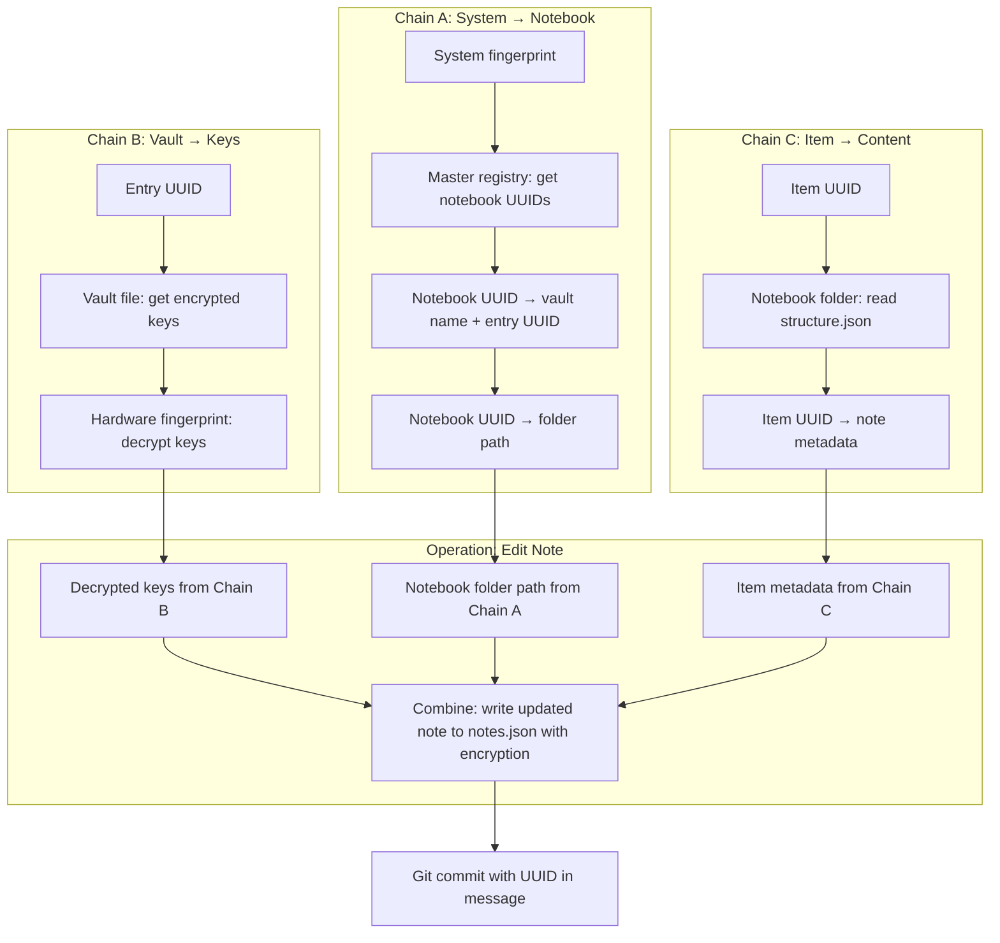

# UUID Convergence Architecture

## Emergent Coordination Through One‑Way Chains

This document describes an architectural pattern observed in a working system. The pattern is not claimed as an invention; it is documented as an accidental discovery from building a portable, offline‑first writing environment. The description focuses on observable behavior, not on novelty or superiority.

---

## 1. The Core Observation

Multiple independent UUID‑based chains, each originating from a different module (registry, vault, filesystem, Git), converge at a single operation (create, edit, delete, rename, search, timeline) without any central coordinator. Each chain is resolved through O(1) deterministic lookups. The chains intersect at UUIDs but do not merge; they remain independent and are rebuilt for every operation.

---

## 2. The Components

| Component | Artifact | Role |
|-----------|----------|------|
| **Master registry** | `notebooks_registry.json` | Maps system fingerprint → notebook UUIDs; notebook UUID → (vault name, entry UUID) |
| **Vault registry** | `vaults_registry.json` | Maps vault name → file path (local or network URL) |
| **Vault file** | `*.vault` or `session.vault` | Maps entry UUID → encrypted keys (AES‑256‑GCM) |
| **Notebook folder** | `structure.json`, `notes.json`, `files.json` | Maps item UUID → metadata / content |
| **Git repository** | Inside notebook folder | Stores commit history; commit messages contain UUIDs |
| **System fingerprint** | Derived at runtime (hardware) | Never stored; used to decrypt vault entries |

---

## 3. One‑Way O(1) Chains

Each chain is a directed sequence of key lookups. Every step is O(1) because it uses a dictionary (hash map) keyed by a UUID.

### Chain A: Notebook Location Resolution
```
system fingerprint → [notebook UUIDs]          (master registry)
notebook UUID → (vault name, entry UUID)       (master registry)
vault name → vault file path                   (vault registry)
notebook UUID → notebook folder path           (master registry or separate index)
```

### Chain B: Vault Key Retrieval
```
entry UUID → encrypted keys (from vault file)  (vault file dictionary)
encrypted keys + fingerprint → decrypted keys  (AES‑GCM decryption)
```

### Chain C: Item Content Access
```
item UUID → note metadata (structure.json)     (dictionary lookup)
item UUID → note content (notes.json)          (dictionary lookup)
```

### Chain D: History Traversal
```
item UUID → Git log query                      (git log --grep)
commit hashes → commit messages                (Git output parsing)
```

All chains are **one‑way** – they never return to a previous step. They have no branching logic (other than existence checks). They are **deterministic** – given the same artifact state, the result is identical.

---

## 4. Convergence at the Operation Point

When a user performs an action (e.g., create a note), the system does not execute a single control flow. Instead, multiple independent chains are triggered by the UI action. They run concurrently or sequentially, but each chain only knows its own origin and its own target. They converge at the **same physical operation** – writing to a file, committing to Git, updating a registry – without any central coordinator.

The UUIDs act as **rendezvous points**: different chains use the same UUID to locate the same artifact, but they do not exchange information. For example:

- Chain A uses notebook UUID to find the notebook folder.
- Chain B uses the same notebook UUID to find the vault entry and decrypt keys.
- Chain C uses the same notebook UUID to locate the structure file for updating.

The operation (write to `structure.json`) receives data from multiple chains (which keys to use for encryption, which path to write, which Git commit message to create) but the chains themselves remain independent.

---

## 5. Flowchart of Convergence

The following diagram illustrates how three independent UUID chains converge at the operation "Edit a note". Each chain starts from a different origin (system fingerprint, item UUID, Git state) and all meet at the filesystem write.



The chains do not merge; they only feed data into the operation. The operation is the **meeting point**, not a master process.

---

## 6. Why O(1) Complexity Is Achievable

Each resolution step uses a direct key lookup in a static dictionary (JSON object). The dictionary is read from disk or network once per operation (or cached with validation). There is no iteration over lists, no search across unrelated entries, no pattern matching. Therefore, the time to resolve a UUID does **not** grow with the number of notebooks, vaults, or items.

The only operations that do not follow O(1) are:

- Git log queries (O(log N) due to index) – but the resolution from UUID to the command is O(1).
- Traversal of notebook hierarchy for activity view (proportional to number of descendants) – but each step is O(1).

---

## 7. Accidental Emergence

This pattern was not designed from first principles. It emerged from solving practical problems:

- Keep keys separate from data (vault file).
- Keep notebook metadata separate from content (three‑JSON split).
- Use UUIDs to avoid name collisions and track items across renames.
- Use dictionary lookups for speed (avoid searching).
- Cache keys only temporarily (SessionKeyVault) with validation.

The result is a system where hundreds of independent UUID chains coexist, each serving a specific purpose, yet they converge cleanly at every operation without a central controller.

---

## 8. Portability Across Media

The UUID chains work identically whether the artifacts are stored on:

- Local hard drive
- USB flash drive
- Network file share
- HTTP/HTTPS server (vault file)
- Public Git repository (notebook data)

The resolution steps remain the same; only the method of reading the artifact changes (local file vs. network fetch). The system does not distinguish between media; it treats all as “files at paths” (where a path can be a URL).

---

## 9. Relation to Operation Types

The convergence pattern applies to every major operation in the application:

| Operation | Chains Involved | Meeting Point |
|-----------|----------------|---------------|
| Create note | Notebook location, vault keys, new UUID generation | Write to `notes.json` and `structure.json` |
| Edit note | Notebook location, vault keys, item UUID | Write to `notes.json`, Git commit |
| Delete note | Notebook location, vault keys, item UUID | Remove from `structure.json`, Git commit |
| Rename note | Notebook location, vault keys, item UUID | Update `structure.json`, Git commit |
| Search | Current notebook hierarchy, vault keys (to decrypt) | Display results (no write) |
| Timeline | Item UUID, Git log | Parse commit messages |
| Activity | Notebook UUID, descendant UUIDs, Git log | Aggregate results |

In every case, multiple independent chains converge at the operation point. The operation does not control the chains; it merely receives their outputs.

---

## 10. No Central Coordinator

The system has no:

- Central service or daemon.
- Message bus or event queue.
- Shared memory or lock.
- Network session or handshake.

All coordination is achieved through **static data** – the UUIDs embedded in JSON files, registry entries, and Git commit messages. The application is an interpreter that reads these artifacts and follows deterministic resolution rules. The artifacts themselves “contain” the coordination logic in the form of UUID pointers.

This is the essence of **emergent coordination**: order arises from the data, not from a controlling process.

---

## 11. Conclusion

The architecture described here is a working system. It demonstrates that multiple independent O(1) UUID chains can converge at a single operation without a central coordinator, using only portable artifacts and deterministic lookups. The pattern is not claimed as an invention; it is documented as an observed property of a system built under practical constraints.

The code is open. The artifacts are self‑describing. The reader may verify the behavior independently.
