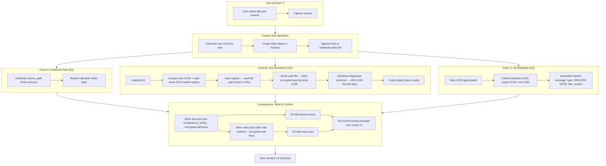
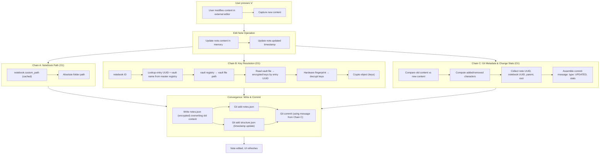
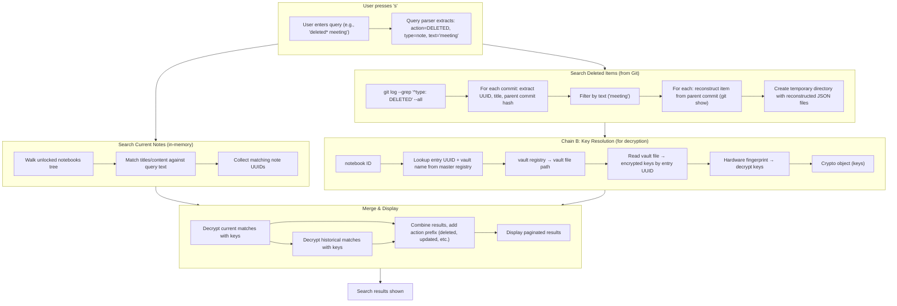
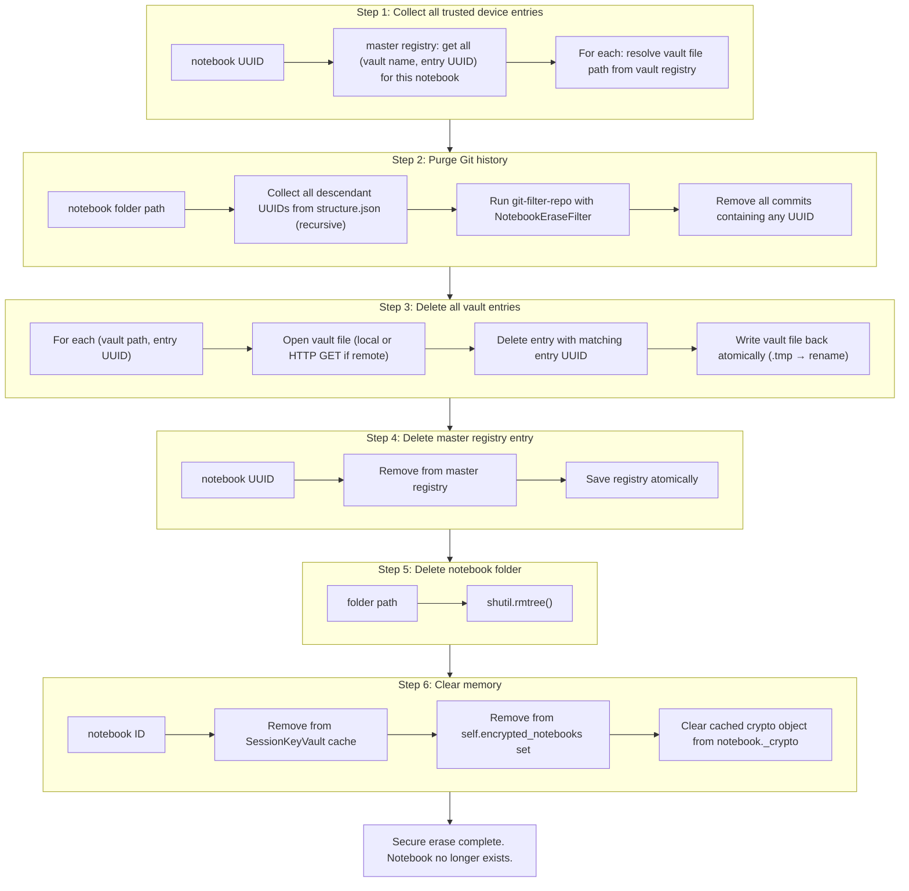

# UUID‑Based Architecture

## A Technical Description of Observable Behavior

This document describes the internal mechanics of a system that coordinates operations across multiple independent storage artifacts using deterministically resolved UUID chains. The description is based on the code as it exists and the behavior observed during execution. No claim of novelty or superiority is made. The purpose is to document what the system does, how it achieves O(1) resolution across local and network storage, and how complex operations (create note, edit note, search deleted items, secure erase notebook) are executed as a sequence of small, stateless steps.

The system uses three independent resolution chains that start from different identifiers, proceed in parallel, and converge only at the final write or display operation. Each chain is O(1) per step and does not require a central coordinator.

---

## 1. Core Design Principle

The system does not rely on a central coordinator, a persistent database, or a background service. Instead, every operation is performed by following **multiple deterministic UUID chains** that start from different origins:

- **Chain A:** Resolves the notebook folder path (from an in‑memory object).
- **Chain B:** Resolves the decryption keys (from the master registry, vault registry, and vault file).
- **Chain C:** Prepares the note data and Git commit metadata (from user input and the note object).

These chains execute independently but are orchestrated by the code order. Their outputs converge at the **write phase** (filesystem and Git) for create, edit, delete, rename, or at the **display phase** for search, timeline, and activity.

---

## 2. Artifacts and Identifiers

| Artifact | Format | Stored Where | Contains |
|----------|--------|--------------|----------|
| **Master registry** | `notebooks_registry.json` | Local disk (or network share) | Maps system fingerprint → list of notebook UUIDs; maps notebook UUID → (vault name, entry UUID, folder path) |
| **Vault registry** | `vaults_registry.json` | Local disk (or network share) | Maps vault name → absolute path or URL to the vault file |
| **Vault file** | `*.vault` or `session.vault` | Any reachable location (local, USB, S3, WebDAV) | Dictionary: entry UUID → (encrypted keys, nonce, timestamp) |
| **Notebook folder** | `structure.json`, `notes.json`, `files.json` | Any reachable location | Note metadata and encrypted content, keyed by item UUID |
| **Git repository** | Inside notebook folder | Local or remote (GitHub, GitLab) | Commit history; commit messages contain UUIDs and action types |
| **System fingerprint** | Derived at runtime | Never stored | Hash of machine identifiers (machine ID, product UUID, hostname, etc.) |

All UUIDs are used as **static pointers**. The system never searches; it always resolves by direct key lookup.

---

## 3. Example Operation: Create Note (`c`)

The user presses `c`, enters title and content, and chooses an editor. The system spawns three independent chains.



---

## 4. Example Operation: Edit Note (`e`)

The user presses `e`, modifies content in an external editor, and saves. The system updates the note object and triggers the three chains.



---

## 5. Example Operation: Search for Deleted Items (`s deleted*`)

The user enters a query with an action wildcard. The system parses the query, then runs two parallel searches: one over current in‑memory notes and one over Git history. The results are merged and displayed.



---

## 6. Example Operation: Secure Erase Notebook

This operation removes all traces of a notebook: its folder, its Git history, all vault entries (for every trusted device), and its registry entry.



---

## 7. Multi‑Cloud Operation Without Complexity

Because all artifacts are addressed by path or URL, the same O(1) resolution chains work across different cloud providers:

| Artifact | Possible Location | Resolution Step | O(1) Lookup |
|----------|-------------------|-----------------|--------------|
| Master registry | Local disk, USB, network share | Read JSON file | Yes |
| Vault registry | Local disk, USB, network share | Read JSON file | Yes |
| Vault file | S3 bucket, Backblaze B2, WebDAV server | HTTP GET at known URL | Yes (dictionary lookup in vault file) |
| Notebook folder | Local disk, NFS, Git remote | Path or Git clone | Yes (once resolved) |
| Git remote | GitHub, GitLab, self‑hosted | `git clone` or `git pull` | Yes (fixed URL) |

The system does **not** perform distributed consensus, two‑phase commit, or cross‑cloud locking. It simply reads files from their respective locations. If a location becomes unavailable, the operation fails cleanly (missing vault, missing notebook). Recovery is possible using the recovery phrase.

---

## 8. Theoretical Observations

The behavior observed in this system aligns with several theoretical concepts, although no prior work combines them in the same way.

- **Deterministic resolution** – UUIDs as static pointers resemble **content‑addressable identifiers** (IPFS, Git). Unlike those systems, this system uses dictionary lookups in registry files, not hash‑based addressing.
- **Stateless pipeline** – The sequential O(1) chains resemble a **pipe‑and‑filter** architecture (Shaw & Garlan, 1996) but without an explicit orchestrator. The pipeline is implicit in the data dependencies.
- **Ephemeral binding** – Deriving a decryption key from runtime hardware identifiers without storing it is analogous to **hardware‑rooted trust** (TPM, WebAuthn PRF) but implemented in software only.
- **Emergent convergence** – Multiple independent chains converge on a single operation without a central coordinator. This is an example of **coordinated action through shared data** (stigmergy).

These references are not claims of influence. They illustrate that the observed properties have been discussed in the literature, but the specific combination found in this codebase appears to be original.

---

## 9. Conclusion

The system executes operations as a set of independent, deterministic O(1) resolution chains that start from different identifiers (notebook path, decryption keys, Git metadata) and converge only at the final write or display phase. The chains are orchestrated by the code order, not by a central coordinator. The system works across local disks, USB drives, and cloud storage without changing its complexity.

The code is open. The behavior is observable. The description above is based on what the system does, not on what it claims to be. The reader is invited to inspect the source and verify the described properties independently.

```
