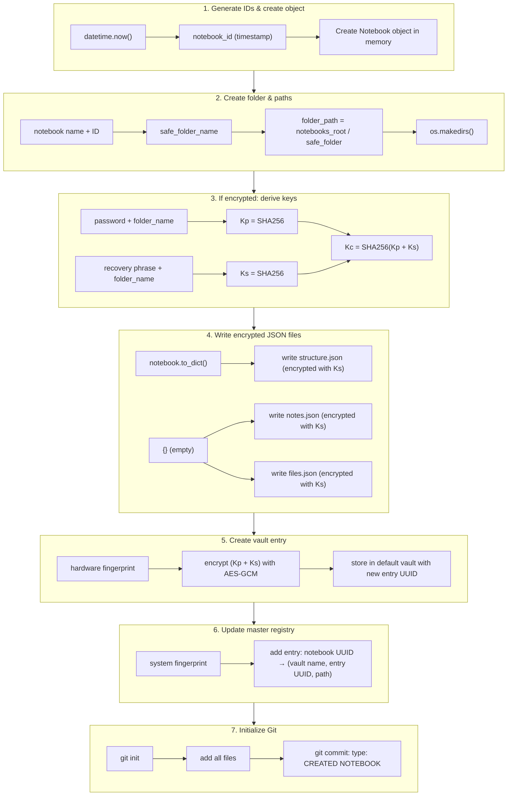
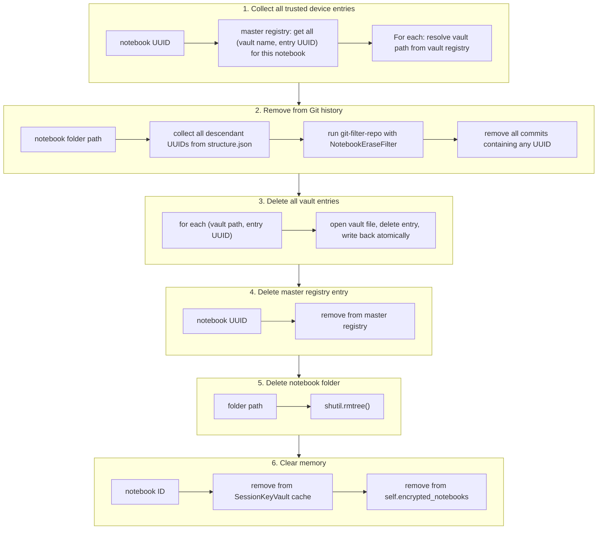
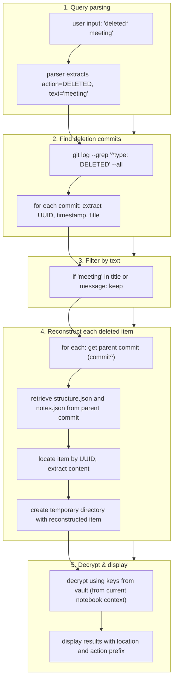

# UUID‑Based Architecture

## A Technical Description of Observable Behavior

This document describes the internal mechanics of a system that coordinates operations across multiple independent storage artifacts using deterministically resolved UUID chains. The description is based on the code as it exists and the behavior observed during execution. No claim of novelty or superiority is made. The purpose is to document what the system does, how it achieves O(1) resolution across local and network storage, and how complex operations (create notebook, secure erase notebook, search for deleted items) are executed as a sequence of small, stateless steps.

---

## 1. Core Design Principle

The system does not rely on a central coordinator, a persistent database, or a background service. Instead, every operation (create, edit, delete, erase, search, timeline, activity) is performed by following a **deterministic chain of UUID lookups**. Each lookup reads a static artifact (a JSON file, a vault entry, a Git commit message) and produces either another UUID or a piece of data (a file path, a decryption key, a note content).

The chain is **sequential**: one step must complete before the next can begin. However, each step is **O(1)** because it uses a direct dictionary key lookup (hash map) or a fixed cryptographic operation (SHA256, AES‑GCM). The total time for a chain is the sum of its O(1) steps, which is constant regardless of the number of notebooks, notes, or trusted devices.

The chain can cross from local disk to network storage (e.g., an S3 bucket, a WebDAV share, a public Git repository) without changing its deterministic nature. The system treats a remote file as a “path” (URL) and reads it via HTTP or Git protocol. Because the steps remain O(1), the operation’s complexity does **not** grow with network latency – only the wall‑clock time increases.

---

## 2. Artifacts and Identifiers

| Artifact | Format | Stored Where | Contains |
|----------|--------|--------------|----------|
| **Master registry** | `notebooks_registry.json` | Local disk (or network share) | Maps system fingerprint → list of notebook UUIDs; maps notebook UUID → (vault name, entry UUID, folder path) |
| **Vault registry** | `vaults_registry.json` | Local disk (or network share) | Maps vault name → absolute path or URL to the vault file |
| **Vault file** | `*.vault` or `session.vault` | Any reachable location (local, USB, S3, WebDAV) | Dictionary: entry UUID → (encrypted keys, nonce, timestamp) |
| **Notebook folder** | `structure.json`, `notes.json`, `files.json` | Any reachable location | Note metadata and encrypted content, keyed by item UUID |
| **Git repository** | Inside notebook folder | Local or remote (GitHub, GitLab) | Commit history; commit messages contain UUIDs and action types |
| **System fingerprint** | Derived at runtime | Never stored | Hash of machine identifiers (machine ID, product UUID, hostname, etc.) |

All UUIDs are used as **static pointers**. The system never searches; it always resolves by direct key lookup.

---

## 3. O(1) Deterministic Resolution Chain

The following steps are executed in a fixed order for any operation that requires decryption (e.g., viewing or editing a note):

```
system fingerprint (runtime) → master registry → list of notebook UUIDs
  ↓ (selected notebook)
notebook UUID → master registry → (vault name, entry UUID, folder path)
  ↓
vault name → vault registry → vault file path (URL)
  ↓
entry UUID → vault file → encrypted keys
  ↓
encrypted keys + system fingerprint → AES‑GCM decryption → plaintext keys
  ↓
folder path + keys → read/decrypt notebook files
```

Each arrow is O(1). The number of steps is constant (about 7). The same chain works whether the vault file is on a local USB drive or on an S3 bucket in a different cloud provider.

---

## 4. Example Operation: Create Notebook

The following steps execute in a fixed order; each step uses O(1) lookups or cryptographic operations.



**Observable properties**:

- The order is fixed and deterministic.
- Each step uses only the outputs of previous steps.
- No step communicates with a central coordinator.
- The entire operation completes in constant time (apart from I/O).

---

## 5. Example Operation: Secure Erase Notebook

This operation removes all traces of a notebook: its folder, its Git history, all vault entries (for every trusted device), and its registry entry.



**Observable properties**:

- The order respects dependencies: you cannot delete the folder before removing Git history; you cannot remove Git history before collecting descendant UUIDs.
- All steps are O(1) per trusted device (the number of devices is small).
- The operation is irreversible; there is no rollback.

---

## 6. Example Operation: Search for Deleted Items (`deleted*`)

Search uses a query parser that recognises `deleted*` (action), `note*` (type), `in*` (scope), etc. It combines current notes (in‑memory) and historical items (via Git log). The resolution chain for historical items is:



**Observable properties**:

- The search does not require a central index. It uses Git’s `--grep`, which is O(log N) internally, but the resolution from UUID to the Git command is O(1).
- Deleted items found in Git are reconstructed on‑demand; the system does not pre‑compute a full list.
- The same keys chain (from Section 3) is used to decrypt the results.

---

## 7. Multi‑Cloud Operation Without Complexity

Because all artifacts are addressed by path or URL, the same O(1) resolution chain works across different cloud providers:

| Artifact | Possible Location | Resolution Step | O(1) Lookup |
|----------|-------------------|-----------------|--------------|
| Master registry | Local disk, USB, network share | Read JSON file | Yes |
| Vault registry | Local disk, USB, network share | Read JSON file | Yes |
| Vault file | S3 bucket, Backblaze B2, WebDAV server | HTTP GET at known URL | Yes (dictionary lookup in vault file) |
| Notebook folder | Local disk, NFS, Git remote | Path or Git clone | Yes (once resolved) |
| Git remote | GitHub, GitLab, self‑hosted | `git clone` or `git pull` | Yes (fixed URL) |

The system does **not** perform a distributed consensus, a two‑phase commit, or a cross‑cloud lock. It simply reads files from their respective locations. If a location becomes unavailable, the operation fails cleanly (missing vault, missing notebook). Recovery is possible using the recovery phrase.

---

## 8. Theoretical References (Supporting Observations)

The behavior observed in this system aligns with several theoretical concepts, although no prior work combines them in the same way.

- **Deterministic resolution** – The use of UUIDs as static pointers is reminiscent of **content‑addressable identifiers** (e.g., IPFS, Git). Unlike content‑addressed systems, this system does not rely on hash‑based addressing; it uses dictionary lookups in registry files.
- **Stateless pipeline** – The sequential chain of O(1) lookups resembles a **pipe‑and‑filter** architecture (Shaw & Garlan, 1996) but without an explicit orchestrator. Instead, the pipeline is implicit in the data dependencies.
- **Ephemeral binding** – Deriving a decryption key from runtime hardware identifiers (fingerprint) without storing it is analogous to **hardware‑rooted trust** (e.g., TPM) but implemented in software only. The concept of “device binding” appears in standards like WebAuthn PRF (W3C, 2019).
- **Emergent coordination** – The fact that multiple independent resolution chains converge on a single write operation without a central controller is an example of **coordinated action without coordination** (Hewitt, 2010; “actor model” but without message passing). In this system, coordination emerges through shared artifacts.

These references are not claims of influence. They are provided to illustrate that the observed properties have been discussed in the literature, but the specific combination found in this codebase appears to be original.

---

## 9. Conclusion

The system executes operations as a deterministic, sequential chain of O(1) UUID resolutions. Each step reads a static artifact (registry, vault file, JSON file, Git commit) and produces either another UUID or the data needed for the next step. The chain can cross local disk and network boundaries without changing its complexity. Multi‑cloud deployment is a natural consequence of using URLs for artifact locations.

The code is open. The behavior is observable. The description above is based on what the system does, not on what it claims to be. The reader is invited to inspect the source and verify the described properties independently.
