# Terminal Notes Architecture Flowchart

This diagram illustrates the relationships between Python modules, subsystems, and file artifacts in the Terminal Notes application.

```mermaid
flowchart TB
    subgraph UI["🖥️ UI Layer (terminal_notes_ui.py)"]
        direction LR
        TN["TerminalNotes<br/>main loop, screens"]
        CS["ComprehensiveSearch<br/>search UI"]
        CM["NotebookManager<br/>remote mgmt"]
        RU["ResurrectedUI<br/>historical items"]
    end

    subgraph CORE["📦 Core Layer (terminal_notes_core.py)"]
        NM["NoteManager<br/>orchestrator, registry,<br/>crypto, git"]
        NB["Notebook / Note<br/>data models"]
        NAV["SimpleNav<br/>navigation stack"]
    end

    subgraph OPS["⚙️ Operations Layer"]
        NO["NotebookOperations<br/>CRUD + JSON I/O"]
        CH["ChangeNotebookHandler<br/>password, vault, autolock"]
        ER["Eraser<br/>soft/hard delete"]
        RS["Restore<br/>restore from history"]
    end

    subgraph CRYPTO["🔐 Encryption Subsystem"]
        CR["Crypto (crypto.py)<br/>dual-key AES-GCM"]
        SS["SecureSessionStorage<br/>binary vault (legacy)"]
        VM["VaultManager<br/>vault registry + .vault I/O"]
        SKV["SessionKeyVault<br/>RAM cache for keys"]
    end

    subgraph GIT["📜 Git Subsystem"]
        GM["GitManager<br/>commit wrapper"]
        GH["GitHistoryMiner<br/>find deleted/renamed"]
        TE["TimelineEngine<br/>version history"]
        GF["git_filter_repo.py<br/>UUID/notebook erasure"]
    end

    subgraph SEARCH["🔍 Search Subsystem"]
        QP["QueryParser<br/>query language"]
        SSRC["SimpleSearch<br/>current items"]
        CSP["ComprehensiveSearch<br/>current + historical"]
    end

    subgraph UI_HELP["🛠️ UI Helpers"]
        EC["EditorConfig<br/>editor autosave"]
        RES["RecoverySystem<br/>autosave recovery"]
        PI["NotebookImporter<br/>import notebooks"]
    end

    subgraph ARTIFACTS["📁 Artifacts (Files)"]
        direction LR
        MR["Master Registry<br/>notebooks_registry.json"]
        VR["Vault Registry<br/>vaults_registry.json"]
        VF[".vault files<br/>binary key storage"]
        JSON["structure.json<br/>notes.json<br/>files.json"]
        DOT[".tn_test<br/>.tn_recovery<br/>.tn_password"]
        GIT_REPO[".git directory"]
    end

    %% UI to Core
    TN --> NM
    TN --> NAV
    CS --> CSP
    CM --> NM

    %% Core to Operations
    NM --> NO
    NM --> CH
    NM --> GM
    NM --> VM
    NM --> SKV

    %% Core to Crypto
    NM --> CR
    NM --> SS
    NM --> VM

    %% Operations to Crypto
    NO --> CR
    CH --> CR
    ER --> CR
    RS --> CR

    %% Git connections
    NM --> GM
    GM --> GIT_REPO
    GH --> GM
    TE --> GM
    GF --> ER
    ER --> GF

    %% Search connections
    CSP --> QP
    CSP --> SSRC
    CSP --> GH
    CSP --> TE
    CSP --> CS

    %% UI Helpers
    TN --> EC
    TN --> RES
    PI --> NM
    RU --> RS

    %% Artifact relationships
    NM --> MR
    NM --> VR
    VM --> VR
    VM --> VF
    SS --> VF
    NO --> JSON
    CR --> DOT
    GM --> GIT_REPO
    GH --> GIT_REPO
    TE --> GIT_REPO

    %% Styling
    classDef ui fill:#7f8c8d,stroke:#2c3e50,color:white
    classDef core fill:#3498db,stroke:#2c3e50,color:white
    classDef ops fill:#2ecc71,stroke:#2c3e50,color:white
    classDef crypto fill:#e74c3c,stroke:#2c3e50,color:white
    classDef git fill:#f39c12,stroke:#2c3e50,color:white
    classDef search fill:#9b59b6,stroke:#2c3e50,color:white
    classDef artifact fill:#1abc9c,stroke:#2c3e50,color:white

    class TN,CS,CM,RU ui
    class NM,NB,NAV core
    class NO,CH,ER,RS ops
    class CR,SS,VM,SKV crypto
    class GM,GH,TE,GF git
    class QP,SSRC,CSP search
    class EC,RES,PI ui_help
    class MR,VR,VF,JSON,DOT,GIT_REPO artifact
```

## Description

The chart above maps the complete architecture of **Terminal Notes**, a terminal‑based encrypted note‑taking system. It shows:

- **UI Layer** – handles user interaction, screens, command routing, and remote notebook management.
- **Core Layer** – central `NoteManager` orchestrates everything; maintains master registry, navigation stack, and data models.
- **Operations Layer** – CRUD operations, password/vault changes, deletion, and restoration of items.
- **Encryption Subsystem** – dual‑key AES‑GCM encryption, binary vaults (`.vault`), system‑fingerprint key storage, and in‑RAM key cache.
- **Git Subsystem** – commits every change, mines history for deleted/renamed items, provides timeline versions, and permanently erases data via `git‑filter‑repo`.
- **Search Subsystem** – query parser that supports powerful filters (`created*`, `deleted*`, `in*`, `g*`, `date*`, etc.), and searches both current and historical items.
- **UI Helpers** – editor autosave configuration, recovery system, and notebook importer.
- **Artifacts** – master registry (`notebooks_registry.json`), vault registry (`vaults_registry.json`), binary vault files, notebook JSON files, encryption marker files, and Git directories.

Arrows indicate primary data/control flow. For example, `NoteManager` writes to the master registry, calls `NotebookOperations` for CRUD, uses `Crypto` for encryption, and interacts with `GitManager` for commits. `ComprehensiveSearch` uses `GitHistoryMiner` and `TimelineEngine` to query Git history. `Eraser` uses `git_filter_repo` to remove UUIDs permanently. The layout follows a clean separation of concerns, making the system modular and maintainable.
