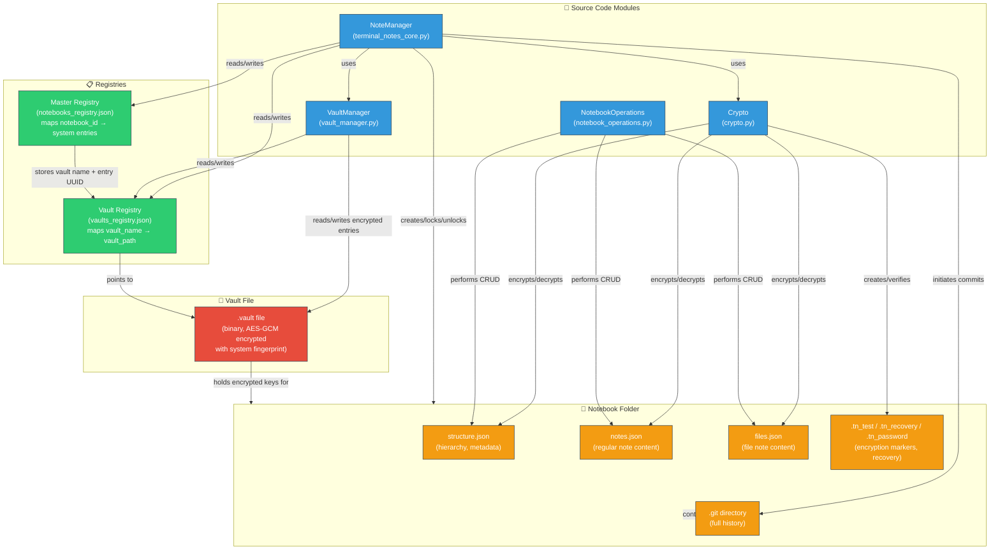

## Description

The diagram shows how source code modules interact with registries, the binary vault, and notebook folders:

- **NoteManager** (core orchestrator) reads/writes the **Master Registry** (maps notebook IDs to per‑system entries) and the **Vault Registry** (maps vault names to file paths). It also uses `VaultManager` and `Crypto` to manage encryption keys.
- **VaultManager** handles the binary `.vault` file – reading/writing entries encrypted with the system fingerprint. Each entry contains a notebook’s combined keys (`password_key + phrase_key`).
- **Crypto** performs the actual AES‑GCM encryption/decryption of the notebook’s JSON files (structure, notes, files) and manages the marker files (`.tn_test`, `.tn_recovery`, `.tn_password`).
- **NotebookOperations** executes CRUD operations directly on the JSON files inside the notebook folder.
- The **notebook folder** contains the encrypted/ext JSON files, marker files, and a `.git` directory for full history. The master registry references this folder via a relative or absolute path.
- The vault registry points to the `.vault` file, and the master registry stores for each system the vault name and the entry UUID inside that vault. This creates a complete chain: **notebook → master registry → vault registry → vault file → encrypted keys → notebook folder decryption**.
